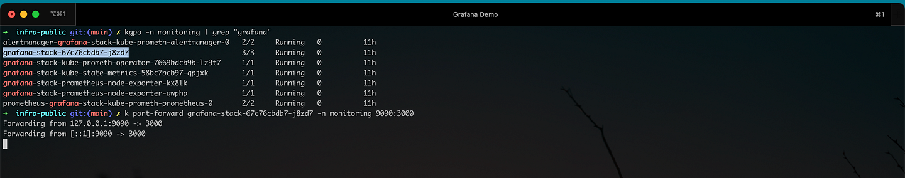

# Exposing Grafana with Emissary Ingress on Amazon EKS: A Step-by-Step Guide to Kubernetes Ingress Management | By M. Sharma

In the realm of Kubernetes and cloud-native applications, the secure and efficient management and exposure of services are of utmost importance. In this context, Ingress controllers play a pivotal role in directing external traffic to services within a cluster. While Nginx and Kong have long been established options, there's a new rising contender known as Emissary Ingress from Ambassador.io.

## Introduction
This article will guide you through the steps of installing Emissary Ingress on an Amazon EKS cluster and demonstrate its usage in exposing Grafana and Prometheus services. Let's dive into detail about the importance of Ingress controllers and why Emissary Ingress is gaining prominence in the Kubernetes ecosystem:

### The Importance of Ingress Controllers:
In Kubernetes, an Ingress controller is a critical component for managing external access to services running within the cluster. It serves as an intelligent traffic management solution, allowing you to route external requests to the appropriate services, often based on factors such as domain names, paths, and other request attributes.

**Here are some key reasons why Ingress controllers are essential in Kubernetes:** </br>
- **Routing and Load Balancing:** Kubernetes clusters typically host multiple services, each with its own set of pods. Ingress controllers act as traffic routers, distributing incoming requests to the correct service and balancing the load across multiple pods within that service. This load balancing enhances application availability and performance.</br>
- **HTTP and HTTPS Termination:** Ingress controllers can handle SSL/TLS termination, allowing you to secure your services using HTTPS. They can also manage SSL certificates, simplifying the process of securing your applications.</br>

- **Path-Based Routing:** Ingress controllers support path-based routing, which means you can route requests to different services based on the URL paths. This is useful for hosting multiple applications or microservices behind a single load balancer.</br>

- **Host-Based Routing:** Ingress controllers enable host-based routing, allowing you to route requests to different services based on the hostnames in the HTTP request. This is particularly useful for hosting multiple domains or subdomains within the same cluster.</br>

**Rewrites and Redirects:** Ingress controllers can perform URL rewrites and redirects, which can be handy for handling legacy URLs, creating vanity URLs, or enforcing security policies.</br>

- **Authentication and Authorization:** Some Ingress controllers support authentication and authorization mechanisms, helping you secure your services by validating user identities and controlling access.</br>

- **Scalability:** Ingress controllers are designed to be highly available and scalable. They can handle a large volume of incoming traffic and adapt to changes in the cluster's service topology.

### Emissary Ingress as a Rising Contender:
Emissary Ingress is gaining recognition as a strong contender among Ingress controllers for Kubernetes, and here's why:

**Kubernetes-Native Design:** Emissary Ingress is purpose-built for Kubernetes, making it a natural fit for managing services in a Kubernetes environment. It leverages Kubernetes custom resources to configure routing rules and policies. <br>

**Flexibility and Extensibility:** Emissary Ingress offers flexibility in defining routing configurations, enabling advanced traffic management and policy enforcement. It's designed to be extensible, allowing you to customize and extend its functionality to suit your specific use cases. <be>

**Envoy Proxy Integration:** Emissary Ingress utilizes the Envoy Proxy as its core component. Envoy is a high-performance, open-source edge and service proxy that provides advanced load balancing, traffic management, and security features. By leveraging Envoy, Emissary Ingress inherits its robust capabilities. <be>

**CNCF Incubating Project:** Emissary Ingress is an incubating project within the Cloud Native Computing Foundation (CNCF). This demonstrates its commitment to community-driven development and adherence to Kubernetes and cloud-native standards. <be>

**Scalability:** Emissary Ingress is built to scale gracefully, making it suitable for managing traffic in large Kubernetes clusters. <br>

As organizations increasingly adopt Kubernetes and microservices architectures, Ingress controllers like Emissary Ingress play a crucial role in ensuring that applications are accessible, secure, and scalable. Emissary Ingress, with its Kubernetes-native design and integration with Envoy, is emerging as a powerful choice for managing ingress traffic and shaping the future of Kubernetes-native API gateways.

## What is Emissary Ingress? 
Emissary-Ingress stands out as the leading Kubernetes-native, open-source API Gateway, known for its scalability, flexibility, and user-friendly approach, making it a preferred choice for managing extensive Kubernetes deployments globally. Emissary-Ingress is a CNCF incubating project and leverages the widely adopted Envoy Proxy at its core.

**Before proceeding, ensure you meet the following prerequisites:**
- An active and functioning Amazon EKS cluster.
- The kubectl command-line tool was installed.
- A basic understanding of Kubernetes concepts.
- Make sure to clone the following GitHub repository to your local system: [Infra Public](https://github.com/Sharmio/infra-public).

### Installing Emissary Ingress on Amazon EKS
Let's kick off the installation process for Emissary-ingress in our cluster:

```YAML
# Add the Repo
helm repo add datawire https://app.getambassador.io
helm repo update

# Create Namespace and Install
kubectl create namespace emissary && \
kubectl apply -f https://app.getambassador.io/yaml/emissary/3.7.2/emissary-crds.yaml
kubectl wait --timeout=90s --for=condition=available deployment emissary-apiext -n emissary-system
```

Emissary-ingress `3.X` includes a Deployment in the `emissary-system` namespace called `emissary-apiext`. This is the APIserver extension that supports converting Emissary-ingress CRDs between `getambassador.io/v2` and `getambassador.io/v3alpha1`. This Deployment needs to be running at all times.

If the `emissary-apiext` Deployment pods all stop running, you will not be able to use `getambassador.io/v3alpha1` CRDs until restarting the `emissary-apiext` Deployment.

```YAML
helm upgrade --install emissary-ingress --namespace emissary datawire/emissary-ingress -f  ./aws/grafana-via-emissary/emissary-values-public.yaml && \
kubectl -n emissary wait --for condition=available --timeout=90s deploy -lapp.kubernetes.io/instance=emissary-ingress
```
I've already prepared a customized [values.yaml](https://github.com/Sharmio/infra-public/blob/main/aws/grafana-via-emissary/emissary-values-public.yaml) file for Emissary Ingress. This configuration will be utilized to create a Network Load Balancer (NLB) for Emissary Ingress, including the setup of AWS Certificate Manager (ACM) on it. Additionally, we're configuring various variables, such as the environment variable `AMBASSADOR_ID` with the value `emissary`. You can view the complete list of custom configurations in the provided values.yaml file.

Now, let's verify the status of these deployments within our EKS cluster to ensure they are running smoothly.

```YAML
kubectl get pods --all-namespaces | grep -E 'emissary|emissary-system'
```


<i>Figure 1: Illustrates the pod information running under emissary and emissary-systemEmissary-ingress should now be successfully installed and operational.</i>

However, before proceeding with deploying services and testing routing to them, it's essential to configure a few more resources. To begin, let's confirm whether the Network Load Balancer (NLB) Listener attached to the TargetGroup is passing health checks or not.


<i>Figure 2: Shows the Registered Target Health Status of EKS Nodes</i>

If your instance health status is not showing as healthy, it's crucial to inspect whether the Emissary Ingress Listener resources have been created correctly for both HTTP and HTTPS. Listeners are essential for specifying which ports the Emissary Ingress pods should listen on to handle incoming requests. I recommend referring to the official documentation from the Ambassador team at https://www.getambassador.io/docs/emissary/latest/topics/running/debugging for further guidance and troubleshooting steps. This documentation can provide valuable insights into debugging and resolving any issues you may encounter with Emissary Ingress.

## Installing & Configuring Grafana with Emissary Ingress
Next, we will proceed with the installation of Grafana on your Amazon EKS cluster. To do this, we'll deploy the kube-prometheus stack, which comprises Kubernetes manifests, Grafana dashboards, and Prometheus rules. These components are combined with documentation and scripts to simplify the process of setting up comprehensive Kubernetes cluster monitoring using Prometheus, all facilitated by the Prometheus Operator.

```YAML
kubectl create ns monitoring

# Get Helm Repository Info
helm repo add prometheus-community https://prometheus-community.github.io/helm-charts
helm repo update
```
See [helm repo](https://medium.com/r/?url=https%3A%2F%2Fhelm.sh%2Fdocs%2Fhelm%2Fhelm_repo%2F) for command documentation.

**Install Helm Chart**

```YAML
helm install [RELEASE_NAME] prometheus-community/kube-prometheus-stack
```

To show the values of the chart, you can simply run:

```YAML
helm show values prometheus-community/kube-prometheus-stack -n <namespace>
```
So, let's call the release name: grafana-stack inside the monitoring namespace:
```YAML
helm install grafana-stack prometheus-community/kube-prometheus-stack -n monitoring
```

<i>Figure 3: Displays the pod information installed by kube-promtheus-stack</i>

## Port-Forward Grafana Pod for Testin
Port-forwarding to a Grafana pod is a helpful way to access the Grafana UI running within your Kubernetes cluster and verify that it's working correctly. 

**Here's a step-by-step guide on how to port forward to a Grafana pod for testing:**
1. Open a Terminal: Open a terminal or command prompt on your local machine. Ensure you have kubectl installed and configured to work with your Amazon EKS cluster.
2. Identify the Grafana Pod: Use the following command to list the pods running in your cluster and find the Grafana pod:
```YAML
kubectl get pods -n <namespace> | grep "grafana"
```
Replace <namespace> with the actual namespace where Grafana is deployed (in our case i.e. monitoring).  Note down the name of the Grafana pod from the list.
3. Port-Forward to the Grafana Pod: Use the kubectl port-forward command to forward a local port to the Grafana pod's port. Typically, Grafana listens on port `3000`. Replace `<grafana-pod-name>` with the name of your Grafana pod and `<local-port>` with an available local port (e.g., `9090`):
kubectl port-forward -n <namespace> <grafana-pod-name> <local-port>:3000


<i>Figure 4: Displays the grafana pod information installed by kube-promtheus-stack</i>

4. Access the Grafana UI Locally: Open a web browser and navigate to the following URL:`http://localhost:<local-port>`
Replace `<local-port>` with the port you specified in the kubectl port-forward command. In the example above, you'd access Grafana at `http://localhost:9090`.

<i>Figure5: Display the Grafana running on local port 9090</i>

5. Login and Test: You may be prompted to log in when you access the Grafana UI for the first time. By default, Grafana may use the username admin and password prom-operator. Please refer to your Grafana configuration for the actual credentials if you've customized them.

<i>Figure 6: Displays the Grafana Password information installed by kube-promtheus-stack via the [K8sLens tool](k8slens.dev).</i>

Once logged in, you can perform initial setup tasks, create dashboards, add data sources, and start testing Grafana.


<i>Figure 7: Displays the Grafana Dashboard on localhost:9090 using Kubectl port-forward service/pod.</i>

## Creating Host and Mapping via Emissary Ingress
For testing purposes, using kubectl port-forward is suitable for quickly testing the functionality. However, in a production environment, it's essential to set up a fully qualified domain name (FQDN) for your Grafana service. This is where the Host and mapping resources provided by Emissary-ingress come into play, enabling you to make your service accessible to everyone through a well-defined domain name and routing configuration. This approach ensures a more robust and reliable service set-up in a production context.

**References** </br>
[1]: https://github.com/Sharmio/infra-public/tree/main/aws/grafana-via-emissary </br>
[2]: https://www.getambassador.io/products/api-gateway</br>
[3]: https://www.youtube.com/channel/UCpSDw2Ih5oOKZBydoq_ptqQ</br>
